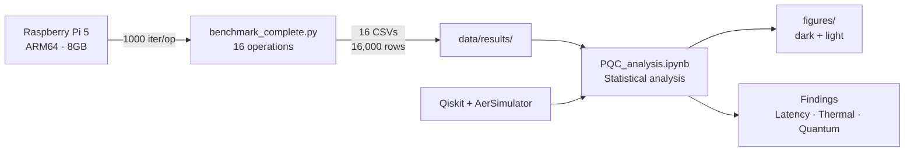
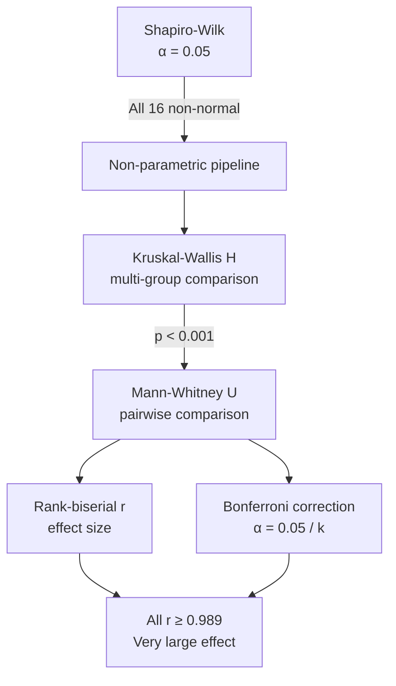

# pqc-benchmarks

[](https://github.com/HuguitoH/PQC-Benchmarks/actions/workflows/tests.yml)
[](https://www.python.org/)
[](LICENSE)

**Empirical performance evaluation of NIST-standardized post-quantum cryptography algorithms on ARM64 IoT hardware.**

Kyber-512 (ML-KEM) and ML-DSA-44 benchmarked against RSA-2048 and ECC-256 across 16,000 measurements on a Raspberry Pi 5. Part of my undergraduate thesis (TFG) at MSMK University, 2025/2026.

---

## Research question

> Are NIST-standardized post-quantum cryptography algorithms (ML-KEM/Kyber-512 and ML-DSA/ML-DSA-44) superior to traditional algorithms (RSA-2048 and ECC-256) for IoT devices based on modern ARM64 architecture (Raspberry Pi 5), considering operational efficiency — latency, energy consumption, memory usage — and differential resistance against the quantum threat projected for 2028–2035?

---

## Key findings

| Algorithm | Operation | Median latency (ms) | vs RSA-2048 |
|---|---|---|---|
| Kyber-512 | keygen | 0.0847 | **2,345× faster** |
| Kyber-512 | decaps | 0.0700 | — |
| ML-DSA-44 | sign | 0.6450 | **5.6× faster** |
| ECDH-256 | derive | 0.2451 | 1,685× faster |
| ECDSA-256 | sign | 0.1852 | 19.5× faster |
| RSA-2048 | keygen | 198.6064 | baseline |
| RSA-2048 | sign | 3.6194 | baseline |

**Speed ratio across all operations: 2,837×** (Kyber-512 Decaps at 0.070 ms vs RSA-2048 KeyGen at 198.606 ms)

- **Perfect statistical separation** — Kyber-512 vs RSA-2048 KeyGen: Mann-Whitney U=0, r=1.000, p<0.001. Every Kyber observation is faster than every RSA observation.
- **All 16 distributions are non-normal** — Shapiro-Wilk W range: 0.29–0.88, all p<10⁻²⁷. Non-parametric tests used throughout.
- **All differences significant after Bonferroni correction** — Kruskal-Wallis H=2651 (KeyGen), H=2663 (Sign), both p<0.001. All pairwise comparisons significant at α_corrected=0.0167.
- **Temperature is an independent metric** — Spearman ρ=0.082, p=0.762 across operations. Kyber's thermal profile is structurally different from RSA, not a side-effect of speed.
- **PQC algorithms are viable for ARM64 IoT deployment** at this hardware tier.

---

## Pipeline overview



---

## Repository structure

```
pqc-benchmarks/
├── benchmarks/
│   ├── benchmark_complete.py   ← main benchmark script (n=1,000)
│   ├── benchmark_keygen.py     ← preliminary keygen experiment (n=500)
│   └── helpers.py              ← sensor utilities: INA219, CPU temp, memory
├── scripts/
│   ├── shor_demo.py            ← animated terminal demo of Shor's algorithm
│   ├── test_ina219.py          ← INA219 sensor validation
│   ├── test_oled.py            ← OLED display validation
│   └── test_quick.py           ← quick 10-iteration test
├── data/
│   └── results/                ← 16 CSVs, raw measurements (1,000 rows each)
├── analysis/
│   └── PQC_analysis.ipynb      ← full statistical analysis
├── figures/
│   ├── dark/                   ← Plotly HTML figures, dark theme
│   └── light/                  ← Plotly HTML figures, light theme
├── tests/
│   ├── conftest.py
│   └── test_pqc.py             ← 123 tests: data integrity, stats fns, Shor oracle
├── docs/
│   └── methodology.md          ← hardware setup, sensor limitations, decisions
├── requirements.txt            ← analysis dependencies
└── requirements-rpi.txt        ← RPi 5 hardware dependencies
```

---

## Run locally

```bash
git clone https://github.com/HuguitoH/pqc-benchmarks
cd pqc-benchmarks
pip install -r requirements.txt

# Full statistical analysis
jupyter notebook analysis/PQC_analysis.ipynb

# Shor's algorithm terminal demo
python scripts/shor_demo.py

# Run tests
pip install pytest
pytest tests/ -v
```

> [!NOTE]
> `benchmarks/benchmark_complete.py` requires a Raspberry Pi 5 with `liboqs` installed and an INA219 sensor connected via I2C. It cannot be run on standard hardware. See `requirements-rpi.txt`.

---

## Dataset

- **16 CSV files** — 1,000 iterations each → **16,000 total measurements**
- **8 metrics per measurement**: `time_ms`, `memory_process_mb`, `memory_system_mb`, `temp_delta_c`, `temp_absolute_c`, `current_ma`, `iteration`, `timestamp`
- **Hardware**: Raspberry Pi 5, 8GB RAM, ARM64, Ubuntu Server 24.04
- **Warm-up**: 10 iterations discarded before each measurement series
- **Cooldown**: 1 s pause every 100 iterations to prevent thermal drift
- **No thermal throttling detected**: global max temperature 40.0°C — 45°C below BCM2712 throttle threshold (85°C)

| Algorithm | Operations measured |
|---|---|
| Kyber-512 | keygen, encaps, decaps |
| ML-DSA-44 | keygen, sign, verify |
| RSA-2048 | keygen, encrypt, decrypt, sign, verify |
| ECDSA-256 | keygen, sign, verify |
| ECDH-256 | keygen, derive |

---

## Statistical methodology

All 16 distributions confirmed non-normal by Shapiro-Wilk (α=0.05). Non-normality is structurally expected: OS scheduling interruptions, garbage collection, and probabilistic operations (RSA KeyGen uses Miller-Rabin primality testing; ML-DSA Sign uses rejection sampling) all produce right-skewed distributions with heavy tails.



| Test | Purpose | Result |
|---|---|---|
| Shapiro-Wilk | Normality — justifies non-parametric choice | 16/16 non-normal |
| Kruskal-Wallis | Multi-group comparison | H=2651 (KeyGen), H=2663 (Sign), p<0.001 |
| Mann-Whitney U | Pairwise comparison | All pairs p<0.001 |
| Rank-biserial r | Effect size (0=none, 1=complete separation) | r≥0.989 for all PQC vs RSA |
| Bonferroni | Multiple comparisons correction | All significant at α=0.0167 |
| Spearman ρ | Correlation: latency vs temperature | ρ=0.082, p=0.762 — independent |

---

## Quantum threat analysis

Shor's algorithm simulated via Qiskit with a correct `UnitaryGate` oracle — not a classical approximation. The oracle evaluates `f(x) = a^x mod N` in genuine quantum superposition.

| Target | Qubits | Circuit depth | CNOTs | Result |
|---|---|---|---|---|
| RSA-15 (N=15) | 8 | 927 | 490 | Factor 3 found ✓ |
| RSA-21 (N=21) | 10 | 9,906 | 5,046 | Factor 3 found ✓ |
| RSA-2048 (theoretical) | ~8,194 logical | O(n³) — intractable | O(n³) | Classically impossible to simulate |

RSA-2048 extrapolation: ~8,194 logical qubits (Gidney & Ekerå, 2021) · ~400,000 physical qubits (Gidney, 2025 optimized). Classical simulation requires 2^8194 amplitudes ≈ 10^2466 — physically impossible.

**Why Kyber-512 resists:** LWE output `b = (As + e) mod q` has R²≈0.003 — statistically indistinguishable from uniform noise. The Quantum Fourier Transform requires periodic structure to extract a period. With R²≈0, there is no exploitable periodicity.

---

## Key size comparison

Larger keys have direct bandwidth implications for constrained IoT networks (LoRaWAN, MQTT over 2G).

| Algorithm | Public key | Private key | Ciphertext / Signature |
|---|---|---|---|
| Kyber-512 | 800 B | 1,632 B | 768 B |
| ML-DSA-44 | 1,312 B | 2,560 B | 2,420 B |
| RSA-2048 | 256 B | 1,193 B | 256 B |
| ECDSA-256 | 64 B | 32 B | 64 B |
| ECDH-256 | 64 B | 32 B | — |

PQC key and signature sizes are significantly larger. Latency favours PQC; bandwidth-constrained deployments must account for this overhead.

---

## Estimated TLS 1.3 handshake cost

> [!CAUTION]
> Calculated projection from empirical medians — not a direct TLS measurement. Network overhead, certificate parsing, and protocol framing are excluded.

| Scenario | Components | Estimated latency |
|---|---|---|
| A: RSA-2048 (legacy) | keygen + encrypt + sign + verify | ~202.7 ms |
| B: ECDH + ECDSA (current) | derive + sign + verify | ~0.784 ms |
| C: Kyber + ML-DSA (full PQC) | decaps + sign + verify | ~1.070 ms |
| D: ECDH + ML-DSA (hybrid) | derive + sign + verify | ~1.101 ms |

Full PQC (C) adds only **+0.286 ms** per handshake vs current ECC (B) — operationally negligible.

---

## Hardware limitations

**INA219 current sensor**: Connected to the RPi 5 power rail via I2C (address 0x40). The sensor captures total bus current rather than isolated per-process current draw. The `current_ma` column represents delta values (after − before) and should be interpreted as a **relative indicator**, not absolute per-operation energy.

This limitation is documented in the thesis and targeted for improvement in Phase 2 (see Future work).

---

## Future work

1. **Direct TLS 1.3 measurement** — OQS-OpenSSL fork with Kyber + ML-DSA on RPi 5, measuring real end-to-end handshake latency
2. **Isolated energy consumption** — dedicated INA219 setup per process, not total bus current
3. **ML-KEM comparison** — final NIST standard (ML-KEM, FIPS 203) vs Kyber-512 used here
4. **Hybrid PQC + Classical** — overhead of combining Kyber + ECDH (NIST transition recommendation)
5. **Lower hardware tier** — reproduce on ESP32 or similar to evaluate feasibility below RPi 5

---

## Context

Post-quantum cryptography addresses the threat that sufficiently powerful quantum computers pose to asymmetric cryptography. RSA and ECC security relies on integer factorization and discrete logarithm hardness — both solvable in polynomial time by Shor's algorithm.

NIST finalized PQC standards in 2024: FIPS 203 (ML-KEM, based on Kyber) and FIPS 204 (ML-DSA, based on Dilithium). This benchmark evaluates whether these standards are viable for resource-constrained IoT environments.

The quantum threat timeline is estimated at 2028–2035 for cryptographically relevant quantum computers (conservative: NIST/NSA; aggressive: IBM/Google roadmaps). The migration window is now.

---

## Citation

If you use this dataset or analysis in your research, please cite:

```bibtex
@misc{hernandez2026pqc,
  author    = {Hernández Moreno, Hugo},
  title     = {PQC Benchmarks: Empirical evaluation of post-quantum
               cryptography on ARM64 IoT hardware},
  year      = {2026},
  publisher = {GitHub},
  url       = {https://github.com/HuguitoH/PQC-Benchmarks}
}
````
---

**Hugo Hernández Moreno** · MSMK University · 2025/2026 · [github.com/HuguitoH](https://github.com/HuguitoH)
